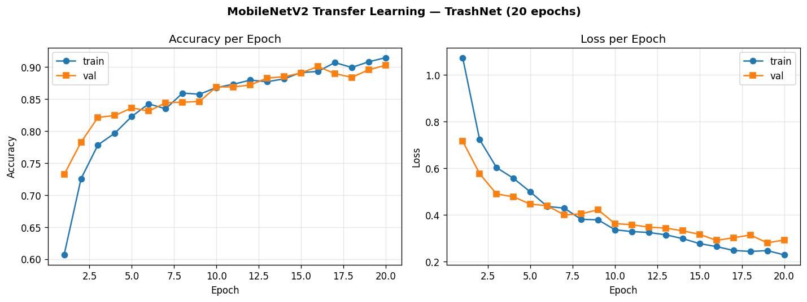

# Results — MobileNetV2 Transfer Learning on TrashNet

Final run of the training pipeline (`scripts/train.py --config configs/train_mobilenet.yaml`),
20 epochs with balanced class weights on the TrashNet 6-class split.

## Final metrics

| Metric | Train | Validation |
|--------|-------|------------|
| Accuracy | 0.9147 | **0.9028** |
| Loss | 0.2290 | 0.2922 |

Validation accuracy rises steadily from 0.732 (epoch 1) to **0.903** (epoch 20)
with no sign of overfitting — the train/val accuracy gap stays around 1 point.

## Training curves

## Grad-CAM samples

Grad-CAM heatmaps for sample images are in [`gradcam_samples/`](gradcam_samples/)
(2 images per class). They show which image regions drove each prediction —
the model focuses on the object rather than the background.

## Files

| File | Description |
|------|-------------|
| `training_curves.png` | Accuracy and loss curves over 20 epochs |
| `history.json` | Per-epoch train/val accuracy, loss, and learning rate |
| `training_log.csv` | Same history in CSV form (Keras `CSVLogger` output) |
| `gradcam_samples/` | 12 Grad-CAM heatmap images (2 per class) |

> The trained `.keras` model files (~11 MB each) are not committed — they are
> regenerated by re-running training. See the [root README](../README.md) for
> the full pipeline.
